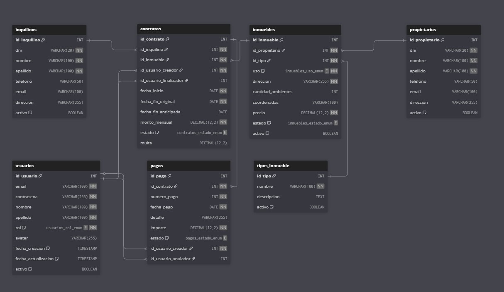

# Inmobiliaria ULP

Sistema de gestión inmobiliaria desarrollado con ASP.NET Core para la Universidad de La Punta.

## Diagrama del Sistema



## Descripción

Este proyecto es una aplicación web para la gestión de propiedades inmobiliarias que incluye:

- **Gestión de Propietarios**: Crear, editar y administrar información de propietarios
- **Gestión de Inquilinos**: Crear, editar y administrar información de inquilinos  
- **Base de datos MySQL**: Almacenamiento persistente de datos
- **Interfaz web responsiva**: Utilizando Bootstrap para una experiencia de usuario moderna

## Tecnologías Utilizadas

- **ASP.NET Core 9.0**: Framework web principal
- **MySQL**: Base de datos
- **Bootstrap**: Framework CSS para la interfaz de usuario
- **Entity Framework**: Para el acceso a datos (usando DAO pattern)

## Estructura del Proyecto

- `Controllers/`: Controladores MVC
- `Models/`: Modelos de datos (Inquilino, Propietario)
- `Views/`: Vistas Razor para la interfaz de usuario
- `DAO/`: Capa de acceso a datos
- `wwwroot/`: Archivos estáticos (CSS, JS, imágenes)

## Cómo Ejecutar

1. Asegúrate de tener .NET 9.0 instalado
2. Configura la cadena de conexión a MySQL en `appsettings.json`
3. Ejecuta el proyecto:
   ```bash
   dotnet run
   ```

## Contribución

Este proyecto es parte del trabajo académico en la Universidad de La Punta.